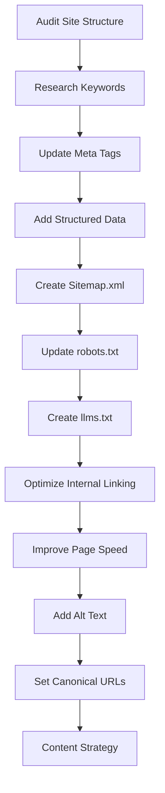

# SEO Implementation Plan for www.lykaconnect.com

## Completed Steps
- Audited site structure and content for SEO readiness
- Researched and selected target keywords: lykaconnect, lykarealty, Dubai real estate, property investment Dubai, Dubai real estate market, Dubai property ROI, Dubai rental yields, Dubai Golden Visa, Dubai property appreciation
- Updated meta tags, titles, and descriptions for all pages

## Next Steps
1. Implement structured data (JSON-LD schema.org) for homepage and key pages
2. Create sitemap.xml
3. Update robots.txt for optimal crawling
4. Create llms.txt for AI crawler compliance
5. Optimize internal linking and navigation
6. Improve page speed and mobile responsiveness
7. Add alt text to all images
8. Set up canonical URLs
9. Plan for ongoing content/blog strategy targeting Dubai real estate

---

## Example Structured Data (Homepage)
```json
{
  "@context": "https://schema.org",
  "@type": "WebSite",
  "name": "Lyka Connect",
  "url": "https://www.lykaconnect.com",
  "potentialAction": {
    "@type": "SearchAction",
    "target": "https://www.lykaconnect.com/search?q={search_term_string}",
    "query-input": "required name=search_term_string"
  }
}
```

## Example Sitemap.xml
- Place in `public/sitemap.xml`
- Include all main pages and priority values

## Example robots.txt
- Already includes sitemap reference
- Add AI crawler directives if needed

## Example llms.txt
- Place in `public/llms.txt`
- Allow major AI bots, reference sitemap

---

## Content Strategy
- Publish regular blog posts targeting Dubai real estate keywords
- Use keyword-rich titles and meta descriptions
- Link internally between related articles and main pages

---

## Mermaid Diagram: SEO Workflow


---

## Next Action
Switch to 💻 Code mode to implement sitemap.xml, llms.txt, structured data, and remaining SEO steps.
